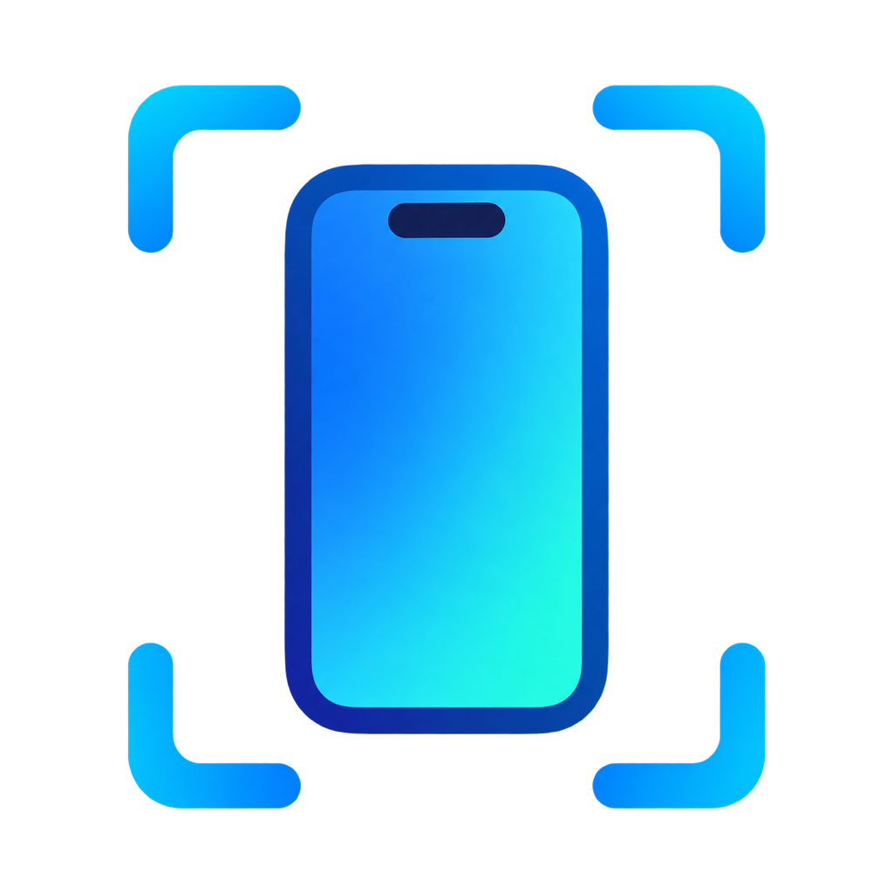
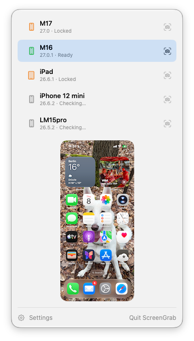
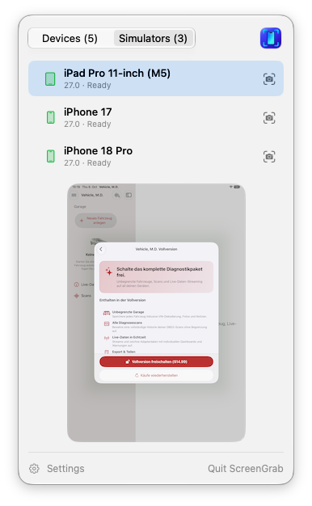

<p align="center">
  
</p>

<h1 align="center">ScreenGrab</h1>

<p align="center">
  Screenshots of your iPhone and iPad from the Mac menu bar or the command line.<br>
  No tunnel daemon, no <code>sudo</code>, no Python – just Xcode's own <code>devicectl</code>.
</p>

ScreenGrab is two things built on the same core:

- **A menu-bar app** that lists your paired iPhones and iPads with their state (ready, locked, not
  reachable), shows a preview of the selected device the moment you open the menu, and saves a
  screenshot with one click. Running iPhone and iPad simulators sit in a second tab, with an optional
  9:41 status bar and transparent rounded corners.
- **`iphone-screenshot`, a CLI** that prints the path of the captured PNG and uses meaningful exit
  codes. It is made for scripts and for AI agents: *"take a screenshot of my iPhone and have a look"*.

<p align="center">
  
  
</p>

## Requirements

- macOS 15 or later (the app targets macOS 26), **Xcode 27 or later** (`devicectl device capture` ships with it).
- iPhones/iPads that are paired and trusted with the Mac, with Developer Mode enabled.
- A device must be unlocked to be captured.

## Install

### CLI via Homebrew

```sh
brew tap mickeyl/formulae
brew install iphone-screenshot
```

### From source

```sh
git clone https://github.com/mickeyl/ScreenGrab.git && cd ScreenGrab
make install-cli   # iphone-screenshot -> ~/.local/bin
make install       # ScreenGrab.app   -> /Applications (needs xcodegen and shark, see below)
```

`make help` lists all targets. The app project is generated with [XcodeGen](https://github.com/yonaskolb/XcodeGen)
and localised with [Shark](https://github.com/kaandedeoglu/Shark) (`brew install xcodegen`); put your signing team
into `App/Config/Local.xcconfig` (`DEVELOPMENT_TEAM = …`).

## The menu-bar app

- Open the menu: devices appear immediately, readiness is checked one device at a time (selected device first), and a preview of the
  most recently used ready device is captured and shown within a second.
- Switch between *Devices* and *Simulators* at the top; each tab shows how many it has and remembers its selection.
- Click a row to preview another device; click the camera button to save a screenshot.
- Click the preview to copy it, or drag it into another app (it arrives as a PNG named like a saved capture).
- Rows are ordered by most recent use (a saved screenshot, or a copied or dragged preview).
- After a capture you get a thumbnail with *Show in Finder*, *Copy* and *Open*.
- Settings: output folder (default `~/Desktop`), copy to clipboard, continuous preview refresh
  (about one frame per second while the menu is open – off by default, it keeps the phone busy), launch at login,
  and for simulators: a clean status bar (9:41, full battery and bars) and transparent rounded corners. Both
  also apply to the preview, so a copied or dragged preview looks exactly like a saved capture. The clean
  status bar is put on the previewed simulator and removed again when you switch away or close the menu;
  status-bar overrides you set yourself are never touched.
- Previews live in `~/Library/Caches/ScreenGrab` and never end up in your screenshot folder.
- English and German.

The app polls only while its menu is open, so it costs nothing in the background.

## The CLI

```sh
iphone-screenshot                           # capture the only ready device to ~/Desktop
iphone-screenshot --device "My iPhone"      # by name or UDID
iphone-screenshot --output-dir /tmp --name home.png
iphone-screenshot list                      # name, udid, ready|locked|unreachable, os (TSV)
iphone-screenshot list --json
iphone-screenshot --simulator               # the only running iPhone/iPad simulator
iphone-screenshot --simulator --device "iPhone 18 Pro" --clean-status-bar --mask-corners
iphone-screenshot list --simulators         # running simulators (always ready)
```

On success the only line on stdout is the path of the PNG. Errors go to stderr.

| Exit code | Meaning |
| --- | --- |
| 0 | Screenshot saved |
| 1 | Capture failed (see stderr) |
| 3 | Device or simulator not found or not running, or several are ready and none was chosen |
| 4 | Device is locked – unlock it and retry |
| 64 | Usage error |
| 127 | Xcode tools not found (Xcode 27+ required) |

`$IPHONE_SCREENSHOT_DEVICE_NAME` sets a default (physical) device. `list --no-probe` returns instantly without
checking readiness.

### Using it from an AI agent

Give your agent a skill or instruction like: *run `iphone-screenshot`, then read the printed PNG.* If it
exits with 4, ask the user to unlock the phone; with 3, run `iphone-screenshot list` and ask which device
is meant.

## How it works

`xcrun devicectl list devices` lists every paired device, whether it is nearby or not, and its
`tunnelState` only reflects the most recently used tunnel. ScreenGrab therefore probes each device with
`devicectl device info lockState` (about 0.6 s, one device at a time, 5 s timeout): success with
`passcodeRequired: false` means *ready*, a passcode requirement or CoreDevice error 10003 means *locked*,
anything else *unreachable*. Screenshots use `devicectl device capture screenshot`, about 0.7 s each.

Simulators come from `xcrun simctl list -j` (booted iPhones and iPads only) and are captured with
`simctl io <udid> screenshot`, also about 0.7 s; the clean status bar is `simctl status_bar … override`.

`devicectl` offers no event stream, so there is no true live video; the optional continuous preview
simply takes screenshots in a loop. The `devicectl` JSON is not a documented contract, so it is parsed
defensively and covered by fixture tests.

## Limitations

- The app launches `xcrun`, so it cannot be sandboxed and is not Mac App Store material.
- Only the default display is captured (relevant for multi-display devices).
- iOS devices must be unlocked; a locked device simply reports *locked*.

## Development

```sh
make test      # ScreenGrabKit unit tests
make build     # generate the Xcode project and build the app
make run       # build and launch with trace logging
```

Layout: `Sources/ScreenGrabKit` (UI-free core), `Sources/iphone-screenshot` (CLI), `App/` (SwiftUI menu-bar
app). See [PLAN.md](PLAN.md) for the design notes and [HIG.md](HIG.md) for the UI tokens.

## License

MIT, see [LICENSE](LICENSE).
